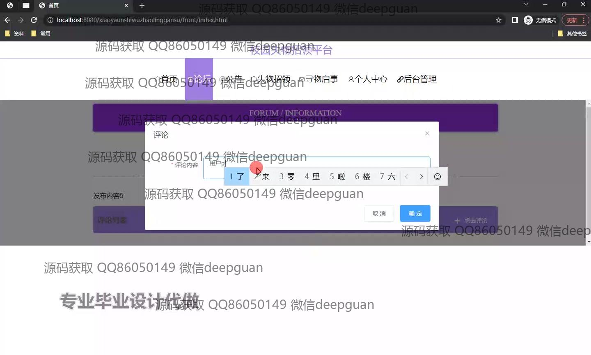

<h1 align="center">基于JAVA的校园失物招领平台的设计与实现+vue</h1>

## 简介
校园失物招领平台：角色分为管理员、用户；论坛互动、失物查询与发布、管理审核、信息维护、用户登录注册。    --计算机毕业设计源码；毕设源码；java毕业设计源码

## 联系方式

<h3 align="center">获取完整代码与数据库文件 + 微信：deepguan QQ: 86050149 QQ群: 783742310</h3>

<h3 align="center">可帮忙远程部署 包运行成功！提供远程部署、修改代码、设计文档指导、代码讲解等服务！</h3>

## 功能介绍（完整见运行截图）
管理员：登录、注册、退出系统，管理平台功能模块，包括轮播图配置、用户管理、论坛管理、失物认领审核、公告发布与管理。支持物品数据查看、编辑与删除，审核失物信息、发布审核意见，管理系统基础数据与学籍档案，提升信息处理效率。

普通用户：登录、注册、退出系统，发布寻物启事或认领失物，查看失物详情、用户公告和论坛帖子，参与论坛讨论并回复评论。支持个人信息查看与修改，管理个人发布的物品信息，提交认领申请。

访客：无需登录即可浏览失物招领平台的公共信息，包括失物招领记录、寻物启事和公告详情，支持按物品类型、名称等条件搜索失物信息。可以查看论坛帖子和公告内容，但无法参与互动。

系统管理员：负责系统运行维护，包括账号角色分配、数据备份与恢复，优化平台性能，确保数据安全与功能模块正常运行。

## 运行截图

本代码来源于网络,仅供学习参考使用!

